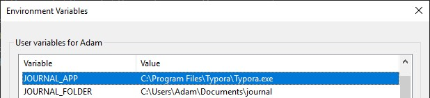

# Journal

Powershell script that will create a markdown journal folder structure.

## Setup

Create environment variables called `JOURNAL_FOLDER` and `JOURNAL_APP`. Set `JOURNAL_FOLDER` to the location of where you want to keep your journal. Set `JOURNAL_APP` to the location of the application you want opened after the journal entry is created.

## Running

Right click on the script and select `Run with PowerShell`.